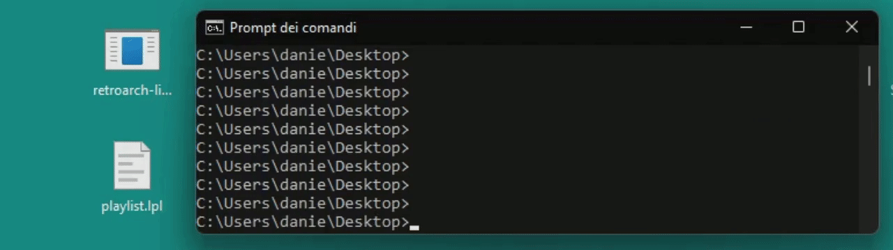

# retroarch-links-generator

[](https://github.com/memob0x/retroarch-links-generator/actions?query=workflow%3AGo) [](https://goreportcard.com/report/github.com/memob0x/retroarch-links-generator) [](http://godoc.org/github.com/memob0x/retroarch-links-generator) [](https://img.shields.io/github/v/tag/memob0x/retroarch-links-generator?label=version)

Generate links to RetroArch playlists entries and launch them like normal games.



## Usage

[Download](https://github.com/memob0x/retroarch-links-generator/releases) the binary file corresponding to your OS environment and launch it from command line with the following arguments:

1. The path to the RetroArch executable file.
2. The game links destination folder path.
3. The RetroArch playlist folder path.

```console
retroarch-links-generator /the/retroarch/executable /the/destination/folder /the/retroarch/playlists
```

It's possible to parse only **certain playlists** with the following command:

```console
retroarch-links-generator /executable /dest ./playlist-1.lpl,./playlist-2.lpl
```

It's possible to directly write **[Steam](https://it.wikipedia.org/wiki/Steam_(informatica)) library shortcuts** providing a path to the right vdf file, usually (steam installation path)/userdata/(your user id)/config/shortcuts.vdf

```console
retroarch-links-generator /the/retroarch/executable /the/steam/shortcuts.vdf
```
